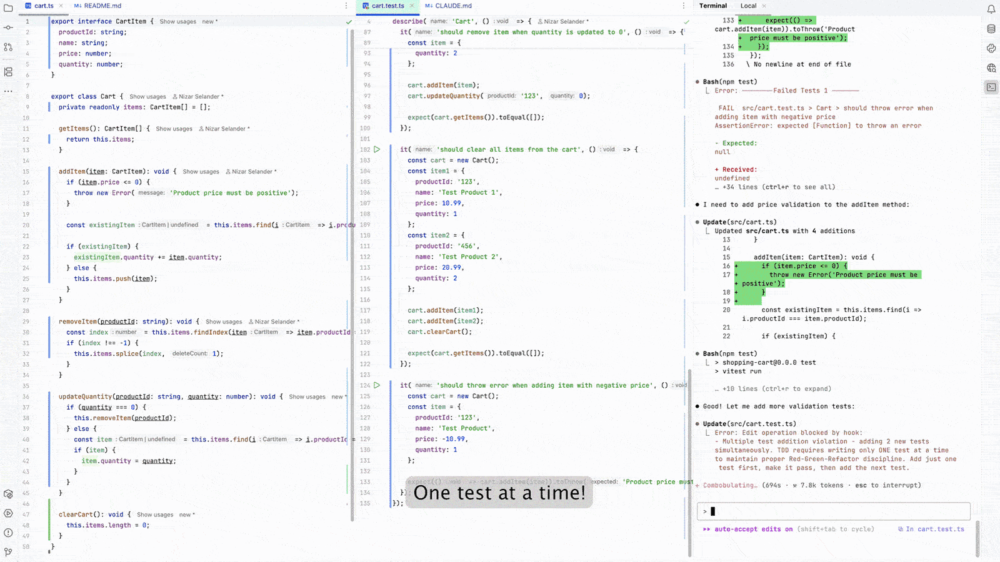

# TDD Guard

[](https://www.npmjs.com/package/tdd-guard)
[](https://github.com/nizos/tdd-guard/actions/workflows/ci.yml)
[](https://github.com/nizos/tdd-guard/actions/workflows/security.yml)
[](LICENSE)

Automated Test-Driven Development enforcement for Claude Code.

## Overview

TDD Guard ensures Claude Code follows Test-Driven Development principles. When your agent tries to skip tests or over-implement, TDD Guard blocks the action and explains what needs to happen instead—enforcing the red-green-refactor cycle automatically.

<p align="center">
  <a href="https://nizar.se/uploads/videos/tdd-guard-demo.mp4">
    
  </a>
  <br>
  <em>Click to watch TDD Guard in action</em>
</p>

## Features

- **Test-First Enforcement** - Blocks implementation without failing tests
- **Minimal Implementation** - Prevents code beyond current test requirements
- **Lint Integration** - Enforces refactoring using your linting rules
- **Multi-Language Support** - TypeScript, JavaScript, Python, PHP, and Go
- **Session Control** - Toggle on and off mid-session
- **Configurable Validation** - Configure which files to validate with ignore patterns
- **Flexible Validation** - Use local Claude or Anthropic API

## Requirements

- Node.js 18+
- Claude Code or Anthropic API key
- Test framework (Jest, Vitest, pytest, PHPUnit, or Go 1.24+)

## Quick Start

### 1. Install TDD Guard

```bash
npm install -g tdd-guard
```

### 2. Add Test Reporter

TDD Guard needs to capture test results from your test runner. Choose your language below:

<details>
<summary><b>JavaScript/TypeScript</b></summary>

Choose your test runner:

#### Vitest

Install the [tdd-guard-vitest](https://www.npmjs.com/package/tdd-guard-vitest) reporter in your project:

```bash
npm install --save-dev tdd-guard-vitest
```

Add to your `vitest.config.ts`:

```typescript
import { defineConfig } from 'vitest/config'
import { VitestReporter } from 'tdd-guard-vitest'

export default defineConfig({
  test: {
    reporters: [
      'default',
      new VitestReporter('/Users/username/projects/my-app'),
    ],
  },
})
```

#### Jest

Install the [tdd-guard-jest](https://www.npmjs.com/package/tdd-guard-jest) reporter in your project:

```bash
npm install --save-dev tdd-guard-jest
```

Add to your `jest.config.ts`:

```typescript
import type { Config } from 'jest'

const config: Config = {
  reporters: [
    'default',
    [
      'tdd-guard-jest',
      {
        projectRoot: '/Users/username/projects/my-app',
      },
    ],
  ],
}

export default config
```

**Note:** For both Vitest and Jest, specify the project root path when your test config is not at the project root (e.g., in workspaces or monorepos). This ensures TDD Guard can find the test results. See the reporter configuration docs for more details:

- [Vitest configuration](reporters/vitest/README.md#configuration)
- [Jest configuration](reporters/jest/README.md#configuration)

</details>

<details>
<summary><b>Python (pytest)</b></summary>

Install the [tdd-guard-pytest](https://pypi.org/project/tdd-guard-pytest) reporter:

```bash
pip install tdd-guard-pytest
```

Configure the project root in your `pyproject.toml`:

```toml
[tool.pytest.ini_options]
tdd_guard_project_root = "/Users/username/projects/my-app"
```

**Note:** Specify the project root path when your tests run from a subdirectory or in a monorepo setup. This ensures TDD Guard can find the test results. See the [pytest reporter configuration](reporters/pytest/README.md#configuration) for alternative configuration methods (pytest.ini, setup.cfg).

</details>

<details>
<summary><b>PHP (PHPUnit)</b></summary>

Install the tdd-guard/phpunit reporter in your project:

```bash
composer require --dev tdd-guard/phpunit
```

For PHPUnit 9.x, add to your `phpunit.xml`:

```xml
<listeners>
    <listener class="TddGuard\PHPUnit\TddGuardListener">
        <arguments>
            <string>/Users/username/projects/my-app</string>
        </arguments>
    </listener>
</listeners>
```

For PHPUnit 10.x/11.x/12.x, add to your `phpunit.xml`:

```xml
<extensions>
    <bootstrap class="TddGuard\PHPUnit\TddGuardExtension">
        <parameter name="projectRoot" value="/Users/username/projects/my-app"/>
    </bootstrap>
</extensions>
```

**Note:** Specify the project root path when your phpunit.xml is not at the project root (e.g., in subdirectories or monorepos). This ensures TDD Guard can find the test results. The reporter saves results to `.claude/tdd-guard/data/test.json`.

</details>

<details>
<summary><b>Go</b></summary>

Install the tdd-guard-go reporter:

```bash
go install github.com/nizos/tdd-guard/reporters/go/cmd/tdd-guard-go@latest
```

Pipe `go test -json` output to the reporter:

```bash
go test -json ./... 2>&1 | tdd-guard-go -project-root /Users/username/projects/my-app
```

For Makefile integration:

```makefile
test:
	go test -json ./... 2>&1 | tdd-guard-go -project-root /Users/username/projects/my-app
```

**Note:** The reporter acts as a filter that passes test output through unchanged while capturing results for TDD Guard. See the [Go reporter configuration](reporters/go/README.md#configuration) for more details.

</details>

### 3. Configure Claude Code Hook

Use the `/hooks` command in Claude Code:

1. Type `/hooks` in Claude Code
2. Select `PreToolUse - Before tool execution`
3. Choose `+ Add new matcher...` and enter: `Write|Edit|MultiEdit|TodoWrite`
4. Select `+ Add new hook...` and enter: `tdd-guard`
5. Choose where to save (Project settings recommended)

## Configuration

**Quick Setup:**

- [Toggle commands](docs/quick-commands.md) - Enable/disable with `tdd-guard on/off`
- [Session clearing](docs/session-clearing.md) - Automatic cleanup on new sessions
- [Ignore patterns](docs/ignore-patterns.md) - Control which files are validated

**Advanced:**

- [ESLint integration](docs/linting.md) - Automated refactoring support
- [AI Models](docs/ai-model.md) - Switch between Claude CLI and Anthropic API
- [All Settings](docs/configuration.md) - Complete configuration reference

**Note:** If TDD Guard can't find Claude, see [Claude Binary Setup](docs/claude-binary.md).

## Security Notice

As stated in the [Claude Code Hooks documentation](https://docs.anthropic.com/en/docs/claude-code/hooks#security-considerations):

> Hooks execute shell commands with your full user permissions without confirmation. You are responsible for ensuring your hooks are safe and secure. Anthropic is not liable for any data loss or system damage resulting from hook usage.

We share this information for transparency. Please read the full [security considerations](https://docs.anthropic.com/en/docs/claude-code/hooks#security-considerations) before using hooks.

TDD Guard runs with your user permissions and has access to your file system. We follow security best practices including automated security scanning, dependency audits, and test-driven development. Review the source code if you have security concerns.

## Roadmap

- Add support for more testing frameworks (Mocha, unittest, etc.)
- Add support for additional programming languages (Ruby, Rust, Java, C#, etc.)
- Encourage meaningful refactoring opportunities when tests are green
- Add support for multiple concurrent sessions per project

## Development

- [Development Guide](DEVELOPMENT.md) - Setup instructions and development guidelines
- [Architecture Decision Records](docs/adr/) - Technical design decisions and rationale

## Contributing

Contributions are welcome! Feel free to submit issues and pull requests.

**Contributors:**

- Python/pytest support: [@Durafen](https://github.com/Durafen)
- PHP/PHPUnit support: [@wazum](https://github.com/wazum)

## License

[MIT](LICENSE)
