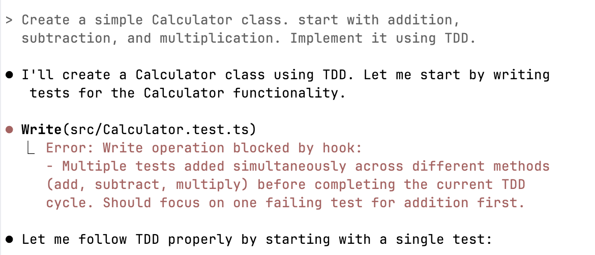
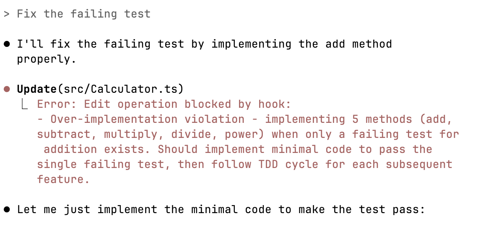

# TDD Guard

[](https://github.com/nizos/tdd-guard/actions/workflows/ci.yml)
[](https://github.com/nizos/tdd-guard/actions/workflows/security.yml)
[](LICENSE)

> ℹ️ **Note**: This project is under active development. Consistent behavior is not yet guaranteed.

A Claude Code hook that enforces Test-Driven Development (TDD) principles by monitoring and validating agent actions in real-time.

It enriches the validation model with context from the agent's current todos and latest test results, enabling intelligent decisions about whether code changes follow TDD practices. This approach enforces TDD without cluttering agent instructions, providing contextual feedback when violations occur.

## Quick Start

### Requirements

- Node.js 18 or higher

### Installation

```bash
git clone https://github.com/nizos/tdd-guard
cd tdd-guard
npm install
npm run build
```

### Configuration

1. Add to `.claude/settings.json`:

```json
{
  "hooks": {
    "PreToolUse": [
      {
        "matcher": "Write|Edit|MultiEdit|TodoWrite",
        "hooks": [
          {
            "type": "command",
            "command": "node /path/to/tdd-guard/dist/cli/tdd-guard.js"
          }
        ]
      }
    ]
  }
}
```

2. Configure test reporter in `vitest.config.ts`:

```javascript
reporters: ['default', new FileReporter('logs/test.txt')]
```

This captures test output for the TDD validation context. Reporters for other test frameworks coming soon.

## Security Notice

As stated in the [Claude Code Hooks documentation](https://docs.anthropic.com/en/docs/claude-code/hooks#security-considerations):

> Hooks execute shell commands with your full user permissions without confirmation. You are responsible for ensuring your hooks are safe and secure. Anthropic is not liable for any data loss or system damage resulting from hook usage.

We share this information for transparency. Please read the full [security considerations](https://docs.anthropic.com/en/docs/claude-code/hooks#security-considerations) before using hooks.

TDD Guard runs with your user permissions and has access to your file system. While we follow security best practices including automated security scanning, dependency audits, and test-driven development, we provide no warranties or guarantees. Use at your own risk and review the source code if you have security concerns.

## How It Works

TDD Guard intercepts Claude Code operations through hooks and validates them against TDD principles:

1. **Hook Integration**: Configured as pre-execution hooks for Edit, MultiEdit, Write, and TodoWrite operations
2. **Data Collection**: Extracts code changes, task descriptions, and test results into persistent storage
3. **Context Building**: Aggregates recent edits, todos, and test output into a validation context
4. **AI Validation**: Sends context to Claude CLI with TDD Guard prompt to check for violations
5. **Decision**: Returns `approve`, `block` (with reason), or `null` (insufficient data)

### Context Engineering

TDD Guard dynamically adjusts context based on operation type. Different instructions are used for different operations, ensuring more focused instructions. Context is formatted with clear markdown sections for better AI comprehension.

## Customizing the System Prompt

To modify TDD validation rules or adjust the AI's behavior, edit the TDD instructions at [`src/validation/prompts/tdd-instructions.ts`](https://github.com/nizos/tdd-guard/blob/main/src/validation/prompts/tdd-instructions.ts). After making changes:

1. Rebuild the project: `npm run build`
2. Restart your Claude Code session to ensure changes take effect

**Tip**: Use `/resume` if you want to continue your previous session after restarting.

## Behaviors Flagged

### Adding Multiple Tests at Once

TDD Guard prevents writing multiple tests before completing the current TDD cycle:



### Over-Implementation

TDD Guard blocks implementing more functionality than the current failing test requires:



More validation rules are being added.

## Example Flow

```
Agent writes test that fails for the right reason
  ↓
Agent tries to implement more than is necessary to make test pass
  ↓
Hook blocks: "Too much code. Only implement what the current test requires"
  ↓
Agent corrects its behavior and implements minimal implementation
```

## Known Limitations

- Creates a new session for each validation, cluttering the session list
- Not tested with multiple subagents working simultaneously
- Currently only supports Claude Code
- Test output context only available for Vitest

## Roadmap

- Use/set global log/data path for persistent storage across projects
- Simplify installation and project setup
- Add support for other testing frameworks (Jest, Mocha, etc.)
- Improve handling of concurrent subagents
- Support other AI agents (Gemini CLI, etc.)
- Optimize session management to reduce clutter
- Expand TDD validation rules
- Enrich context with file paths and more metadata

## Contributing

Contributions are welcome! Feel free to submit issues and pull requests.

## License

[MIT](LICENSE)
